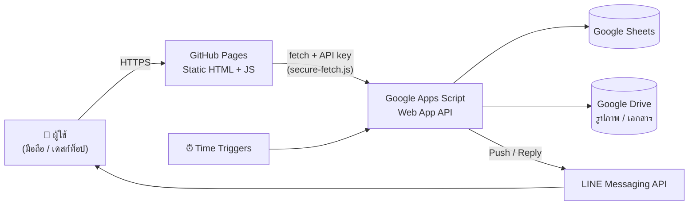

<div align="center">

# 🚑 SAND ระบบยานพาหนะ

**Sansai Administration Network Drive · Fleet Management**

ระบบบริหารจัดการยานพาหนะ โรงพยาบาลสันทราย จังหวัดเชียงใหม่ (เขตสุขภาพที่ 1)
บันทึกการใช้รถ ตรวจสภาพรถ แจ้งซ่อม ตารางเวร พขร. และแจ้งเตือนผ่าน LINE ในระบบเดียว


</div>

---

## 📌 ภาพรวม

SAND ระบบยานพาหนะ พัฒนาขึ้นเพื่อแทนการจดบันทึกด้วยกระดาษ ให้พนักงานขับรถ (พขร.) และผู้บริหารมองเห็นสถานะรถ เลขไมล์ การเติมน้ำมัน และภาระงานได้แบบเรียลไทม์ ผ่านเบราว์เซอร์บนมือถือโดยไม่ต้องติดตั้งแอปเพิ่ม

| ด้าน | รายละเอียด |
|---|---|
| ผู้ใช้งาน | ผู้บริหาร, รองฯ, พนักงานขับรถ, เจ้าหน้าที่ธุรการ |
| สถาปัตยกรรม | Static frontend (GitHub Pages) + REST-style API (Google Apps Script) |
| ฐานข้อมูล | Google Sheets + Google Drive (เก็บรูปภาพ) |
| การแจ้งเตือน | LINE Messaging API (push แบบตั้งเวลา + ตอบสดผ่าน Rich Menu) |

## ✨ ฟีเจอร์หลัก

### 🚗 การใช้รถและบำรุงรักษา
- **บันทึกการใช้รถ** (`startmile.html`) เลขไมล์ต้น–ปลายทาง จุดหมาย การเติมน้ำมัน พร้อมแนบรูปถ่าย
- **ตรวจสภาพรถประจำวัน** (`check.html`) รายงานการตรวจสภาพรถยนต์พร้อมรูปประกอบ
- **แจ้งซ่อมยานพาหนะ** (`fixedcar.html`) แจ้งซ่อมและติดตามสถานะงานซ่อม
- **แก้ไขเลขไมล์** (`editmile.html`) ขั้นตอนขออนุมัติแก้ไข/ลบข้อมูล และตรวจจับค่าไมล์ผิดปกติ
- **ประเมินความพึงพอใจ** (`satisfaction.html`) แบบประเมินการใช้รถ

### 🚨 งาน EMS
- **ตรวจอุปกรณ์ EMS** (`EMScheck.html`) เช็คและเติมอุปกรณ์ประจำรถพยาบาล
- **แดชบอร์ด EMS** (`emsDashboard.html`) ภาพรวมการตรวจ ป้องกันด้วยรหัสผ่าน (SHA-256)

### 📅 ตารางเวรและการแลกเวร
- **ตารางเวรยานพาหนะ** (`worktable.html`) ตารางเวรรายเดือน ตารางงานประจำวัน
- **ระบบแลกเวร พขร.** (`swap.html`) ยื่นคำขอแลกเวร พร้อมตรวจสอบความขัดแย้งของเวรฝั่งเซิร์ฟเวอร์ อนุมัติ/ปฏิเสธ และสร้างบันทึกข้อความ (Google Docs + PDF) อัตโนมัติ รวมทั้งรายงานสรุปรายเดือน

### 📊 ภาพรวมและแผนที่
- **แผงควบคุม** (`dashboard.html`) สถานะรถ สถิติการใช้งาน
- **แผนที่เส้นทาง** (`routemap.html`) แสดงเส้นทางด้วย Leaflet + OSRM และหมุดสถานที่
- **ตรวจจับปั๊มน้ำมัน** อัตโนมัติจากคำสำคัญของสถานที่

### 💬 LINE Integration
- รายงานตั้งเวลาอัตโนมัติ (เช่น รายงานตรวจรถ, ตารางงานประจำวัน 07:30 น., รายงานสัปดาห์)
- **Rich Menu** ตอบสด: "สถานะรถ" และ "ตารางงานของฉัน"
- กำหนดสิทธิ์ตามบทบาท (แอดมิน / รองฯ / พขร.) และบันทึกประวัติการส่งพร้อมปุ่มส่งซ้ำ (`linecontrol.html`)

## 🏗️ สถาปัตยกรรม



**หลักการออกแบบ**
- Backend เป็นสคริปต์เดียว (`Code.gs`) ทำหน้าที่เป็น API: `doGet` สำหรับอ่านข้อมูล, `doPost` สำหรับบันทึก
- ทุก request ผ่านการตรวจ API key แบบ **fail-closed** (หากไม่ได้ตั้งค่าคีย์ จะปฏิเสธทุกคำขอ)
- ใช้ `LockService` ป้องกันการเขียนข้อมูลชนกัน
- อ้างอิงคอลัมน์ด้วย **ชื่อหัวตาราง** แทนตำแหน่งตายตัว เพื่อให้ปรับโครงสร้างชีทได้โดยไม่พัง
- บันทึกการเข้าถึง API ทุกครั้ง (action, IP, ผลการอนุญาต)

## 📁 โครงสร้างโปรเจกต์

```
carsystemsansai/
├── index.html            # หน้าหลัก SAND (เมนูรวมระบบ)
├── dashboard.html        # แผงควบคุมภาพรวม
├── startmile.html        # บันทึกการใช้รถ
├── check.html            # ตรวจสภาพรถประจำวัน
├── editmile.html         # แก้ไข/อนุมัติเลขไมล์
├── fixedcar.html         # แจ้งซ่อม
├── EMScheck.html         # ตรวจอุปกรณ์ EMS
├── emsDashboard.html     # แดชบอร์ด EMS
├── routemap.html         # แผนที่เส้นทาง
├── worktable.html        # ตารางเวร / ตารางงาน
├── swap.html             # ระบบแลกเวร พขร.
├── satisfaction.html     # ประเมินความพึงพอใจ
├── linecontrol.html      # ควบคุมการส่ง LINE
├── secure-fetch.js       # แนบ API key + client IP ให้ทุก request
├── send_core.js          # ตรรกะส่ง LINE และประวัติการส่ง
├── duty.js               # อ่านตารางเวรและเวรประจำวัน
├── admin.js              # ฟังก์ชันสำหรับแอดมิน / LINE catalog
└── README.md
```

> `Code.gs` (Apps Script backend) ดูแลแยกใน Google Apps Script project

## 🚀 การติดตั้ง

### 1) เตรียม Backend (Google Apps Script)
1. สร้าง Google Sheet และเปิด **Extensions → Apps Script**
2. วางโค้ด `Code.gs` แล้วรันฟังก์ชัน setup เพื่อสร้างชีทที่จำเป็น (เช่น `setupAllSheets`, `setupSwapRequestsSheet`, `setupJobAssignmentsSheet`)
3. ตั้งค่า **Project Settings → Script Properties**

   | Key | คำอธิบาย |
   |---|---|
   | `API_KEY` | รหัสสำหรับตรวจสอบคำขอจากหน้าเว็บ (สุ่มสตริงยาวๆ) |
   | `LINE_CHANNEL_ACCESS_TOKEN` | Channel access token ของ LINE Official Account |

4. **Deploy → New deployment → Web app** (Execute as: *Me*, Access: ตามนโยบายหน่วยงาน) แล้วคัดลอก URL
5. รัน `setupReportTriggers` เพื่อตั้งเวลาส่งรายงาน LINE และตั้ง Time Trigger สำหรับรีเซ็ตสถานะรายวัน

### 2) เตรียม Frontend
1. กำหนด `GAS_URL` ในแต่ละหน้าให้ชี้ไปยัง Web App URL ข้างต้น
2. ตั้งค่า `API_KEY` ใน `secure-fetch.js` ให้ตรงกับ Script Properties
3. Push ขึ้น GitHub แล้วเปิด **Settings → Pages** เลือก branch `main`

### 3) เชื่อม LINE (ถ้าใช้งาน)
1. ตั้ง Webhook URL ของ LINE Official Account ให้ชี้ไปที่ Web App
2. ผู้ติดตามจะถูกลงทะเบียนในชีท `LineUsers` อัตโนมัติ — แอดมินกำหนดคอลัมน์ **บทบาท** และ **เบอร์โทร (พขร.)**
3. ตั้งค่าปุ่ม Rich Menu ให้ตรงกับ postback/ข้อความที่กำหนดในโค้ด

## 🗂️ ชีทข้อมูลหลัก

| ชีท | หน้าที่ |
|---|---|
| `ตารางเวร` / `ตารางเวรถัดไป` | ตารางเวร พขร. รายเดือน |
| `ตารางงาน` | มอบหมายงานรายวัน |
| `คำขอแลกเวร` | คำขอและประวัติการแลกเวร |
| `LineUsers` | ผู้รับ LINE, บทบาท, เบอร์โทร |
| `LineSendLog` | ประวัติการส่งข้อความ LINE |

## 🔐 ความปลอดภัยและ PDPA

- ระบบออกแบบสำหรับ **ใช้ภายในหน่วยงาน** (ผู้บริหารและ พขร.)
- ตรวจสอบ API key ทุกคำขอ และบันทึก log การเข้าถึง
- การแก้ไข/ลบเลขไมล์ต้องผ่านรหัสแอดมินหรือขั้นตอนอนุมัติ
- แดชบอร์ด EMS ป้องกันด้วยรหัสผ่านแบบแฮช SHA-256
- ข้อมูลส่วนบุคคล (ชื่อ เบอร์โทร รูปถ่าย) ใช้เพื่อการบริหารงานยานพาหนะเท่านั้น
- **ห้าม commit** ค่า token/secret จริงลง repository สาธารณะ

## 📈 สถิติการใช้งาน

หน้าเว็บฝังตัวติดตามจาก SAND Office Tools เพื่อดูจำนวนผู้เข้าใช้ โดยไม่ใช้คุกกี้และไม่เก็บ IP

```html
<script defer src="https://sandtools.vercel.app/t.js" data-site="prnskn2arc"></script>
```

## 🛠️ เทคโนโลยีที่ใช้

Google Apps Script · Google Sheets · Google Drive · Google Docs · HTML5 · CSS3 · Vanilla JavaScript · Leaflet · OSRM · LINE Messaging API · GitHub Pages

## 👥 ผู้พัฒนาและดูแลระบบ

กลุ่มงานบริหารทั่วไป / ทีมพัฒนาระบบสารสนเทศ **โรงพยาบาลสันทราย** อำเภอสันทราย จังหวัดเชียงใหม่

---

<div align="center">
<sub>© โรงพยาบาลสันทราย · พัฒนาเพื่อใช้ภายในหน่วยงาน</sub>
</div>
